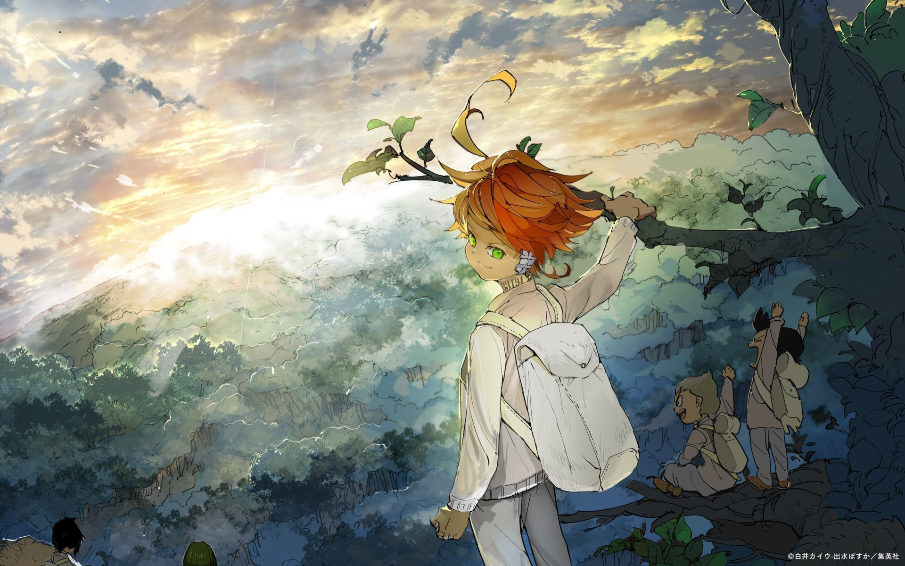

<h1 align="center">Domirando</h1>

  

    - 🔭 Currently working as a Rust develop  
    - 🌱 Currently learning Rust (planning: Data Vizualization)  
    - 💬 Feel free to give any question related to IT  
    - 👯 Looking to collaborate on team of Linux, ReactJS, ...  
    - ⚡️ Mission: Be strong, try hard, so others donʻt need to... 

 

  

## Some Fun Facts about me:
</a>
I'm an organizer of events like Web Hackathon, meetings, etc.! I love listening musics, learning new languages, playing musical instruments and singing. On my channel, I also do live coding! I'm super into sports, including lots of outdoors adventures like badminton, volleyball, basketball. You'll probably run into me in the event, but for now, follow me online or chat with me at a virtual conferences!  

Between don't forget to watch my speech and read my article about Quantum Computers and also sharing them with your friends 😉!  
Speech - <a href="https://youtu.be/zx6nZnJkYR4?si=Q-DCNG2sakugudD6">New age of computers - Quantum computers </a> 
Article - <a href="https://medium.com/@Domirando/quantum-computers-evaluating-the-impact-on-humanity-and-our-readiness-1d6e20c120ed">Quantum Computers: Evaluating the Impact on Humanity and Our Readiness </a>
   
## 💬 Contact with me via:
 
  

