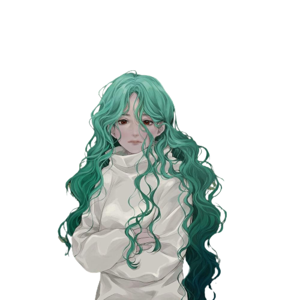
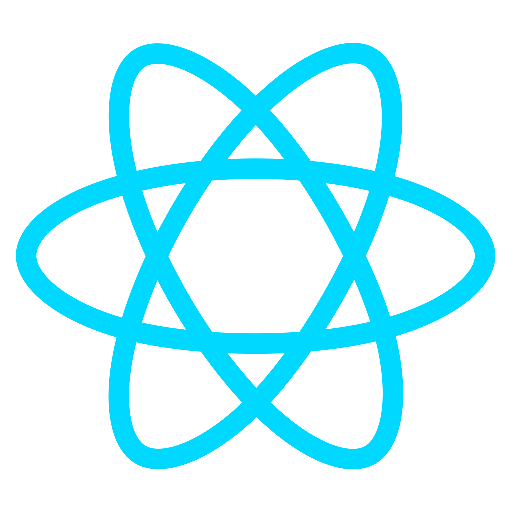

<h1 align="center">Maftuna Vohidjonovna</h1>

  

- 🔭 Currently working as a freelancer  
- 🌱 Currently learning Computer Networking  
- 💬 Feel free to give any question related to IT  
- 👯 Looking to collaborate on team of Next, React, ...  
- ⚡️ Mission: By every step doing and wanna improve and develop... 

## 💬 Contact with me via:

 
 
  

## ⚡️ Social Networks:

 
  

## 🔨 Languages and Tools:

 
 

## ⚜ Domirando's github stats:

