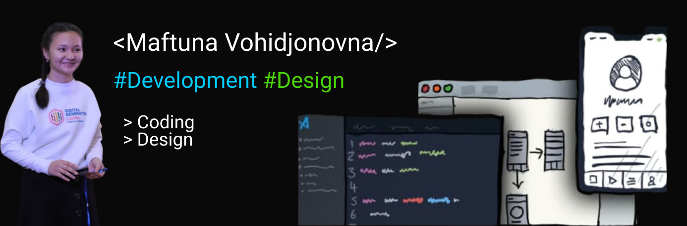

### Hi there 👋

- [LinkedIn](https://www.linkedin.com/in/maftuna-vohidjonovna-a38141211/) • [Telegram](https://t.me/Maftuna_Vohidjonovna) • <a href="vohidjonovnamaftuna@gmail.com">Mail</a>

## 🔨 Languages and Tools:

[][html]
[][css]
[][javascript]
[][java]
[][cplusplus]
[][postgresql]
[][vscode]
[][zsh]
[][powershell]
[][git]
[][github]

 
 

