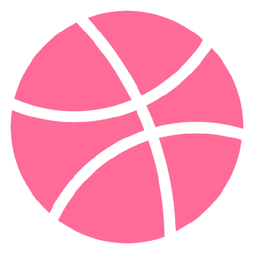

<h1 align="center">Maftuna Vohidjonovna</h1>

  

    - 🔭 Currently working as a freelancer  
    - 🌱 Currently learning Computer Networking  
    - 💬 Feel free to give any question related to IT  
    - 👯 Looking to collaborate on team of NextJS, ReactJS, ...  
    - ⚡️ Mission: By every step doing and wanna improve and develop... 

## 🔨 Languages and Tools:

 
 

  

## Some Fun Facts about me:
</a>
I'm an organizer of events like Web Hackathon, meetings, etc.! I love listening musics, playing musical instruments and singing. On my channel, I also do live coding! I'm super into sports, including lots of outdoors adventures like badminton, volleyball, basketball. You'll probably run into me at an event, but for now, follow me online or chat me at a virtual conference!
   
## 💬 Contact with me via:

 
 
  

## ⚡️ Social Networks:

 
  

## ⚜ Domirando's stats:

