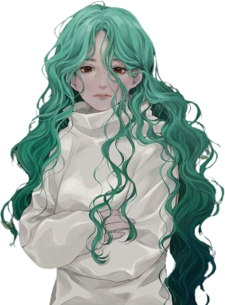

# Maisie Wutsimon

- 🔭 Currently working as a freelancer
- 🌱 Currently learning Python
- 💬 Feel free to give any question related to IT 
- 👯 Looking to collaborate on team of Next, React, ...
- ⚡️ Mission: By every step doind and wanna improve and develop...
##  Contact with me via:

[LinkedIn](https://www.linkedin.com/in/maftuna-vohidjonovna-a38141211/) • [Telegram](https://t.me/ProgrammerGirlX) • <a href="maisiedev@gmail.com">Mail</a>

## 🔨 Languages and Tools:

 
 

## ⚜ Maisie's github stats:

